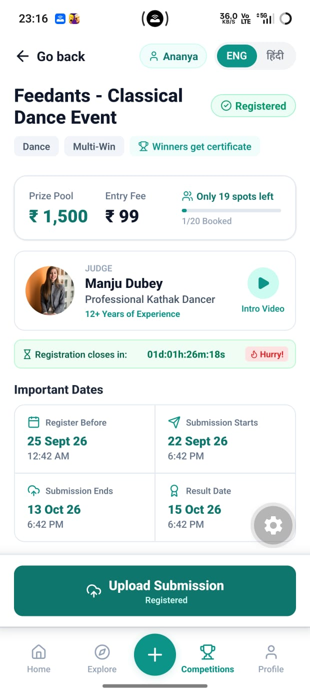
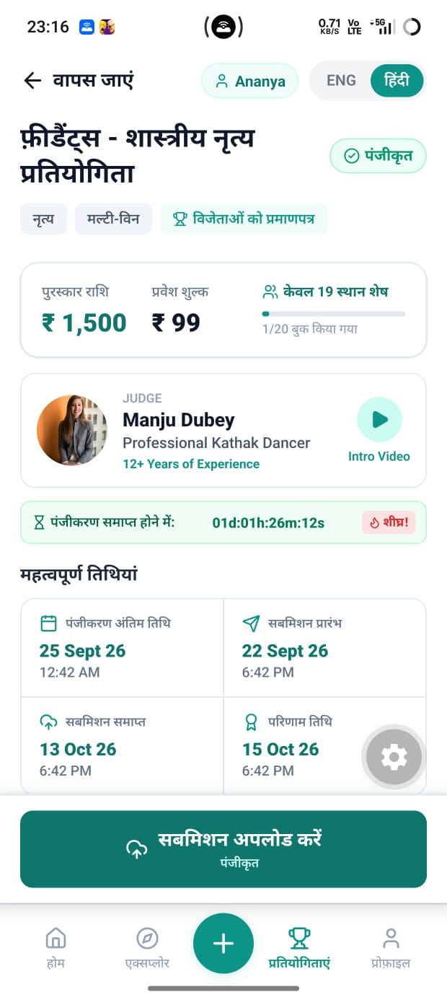
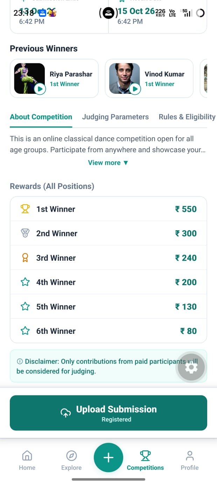
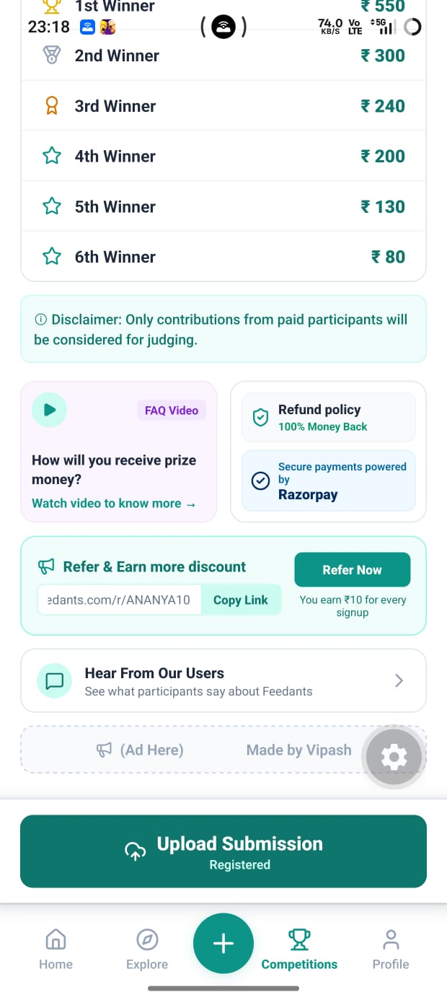

# Feedants — Competition Details Screen (Full-Stack Module)

[](https://github.com/Vipash/Feedants-Assignment/actions/workflows/ci.yml)
[](LICENSE)


A Competition Details module built with **React Native (Expo)**, **Node.js / Express** and **MongoDB Atlas**. It covers the competition lifecycle, race-condition-safe spot reservation under concurrent load, and multi-state participant flows (unregistered → registered → submitted).

> 🎥 **Video walkthrough:** [5-minute implementation demo](https://drive.google.com/file/d/1x3QUyJVrdLnGmqHGK1xn2cPB3qXxZJ_N/view?usp=drive_link)  
> The video was recorded via USB screen mirroring on a resource-constrained development machine. Minor frame drops come from local video encoding, not from application performance.

---

## Table of Contents

1. [Screenshots](#-screenshots)
2. [Tech Stack](#-tech-stack)
3. [Key Features](#-key-features)
4. [Architecture](#%EF%B8%8F-architecture)
5. [API Reference](#-api-reference)
6. [Concurrency Design & Stress Test](#-concurrency-design--stress-test)
7. [Getting Started](#-getting-started)
8. [Continuous Integration](#-continuous-integration)
9. [Assumptions](#-assumptions)
10. [Technical Decisions & Trade-offs](#-technical-decisions--trade-offs)
11. [Known Limitations](#-known-limitations)
12. [Challenges & Lessons Learned](#-challenges--lessons-learned)
13. [Roadmap](#-roadmap)
14. [License](#-license)

---

## 📸 Screenshots

| English (main page) | Hindi (main page) |
| :---: | :---: |
|  |  |

| Middle section | Bottom section |
| :---: | :---: |
|  |  |

---

## 🧰 Tech Stack

| Layer | Technology | Version | Purpose |
| --- | --- | --- | --- |
| Mobile | Expo / React Native | Expo SDK 57 / RN ~0.79 | Cross-platform mobile client |
| Runtime | Node.js | 22 LTS | JavaScript runtime |
| Web framework | Express | ^4.19.2 | REST API and routing |
| ODM | Mongoose | ^8.8.0 | Strict schema modelling and validation |
| Database | MongoDB Atlas | MongoDB 6.0+ | Document database (WiredTiger engine) |
| Middleware | `helmet`, `cors`, `morgan` | – | Security headers, cross-origin policy, request logging |
| Icons | `lucide-react-native` | – | UI iconography matching mockup |
| i18n | Custom dictionaries | – | Dynamic English / हिंदी switching |
| CI | GitHub Actions | Ubuntu + MongoDB 6.0 service | Automated build and concurrency test |

---

## ✨ Key Features

1. **Race-condition-safe spot booking**
   - Spots are reserved with a single atomic MongoDB update guarded by `$expr: { $lt: ['$bookedSpots', '$totalCapacity'] }`, ensuring the capacity check and the increment cannot be separated by concurrent requests.
   - Verified with an automated 30-request concurrent stress test.
2. **Server-driven lifecycle state machine**
   - States: `UPCOMING` → `REGISTRATION_OPEN` → `SUBMISSION_OPEN` → `EVALUATION` → `COMPLETED`.
   - Derived from authoritative server time (UTC), preventing client clock tampering from changing eligibility.
3. **Participant-aware dynamic CTA**
   - The primary action button automatically mutates with the participant's state: `Register Now` → `Upload Submission` → `Submission Uploaded`.
4. **Built-in evaluator switcher**
   - Switch between seeded registered and unregistered users.
   - Dynamically generate randomized guest participants on the fly.
   - Reset the demo state back to `1/20 booked` in one click.
5. **Full bilingual internationalisation**
   - Instant ENG / हिंदी toggle covering headings, metrics, countdowns, tabs and action labels.
6. **Design-faithful layout**
   - Follows the design reference: 2 × 2 Important Dates grid, horizontal previous-winners carousel, 6-tier reward distribution, side-by-side refund/payment trust cards, referral section, ad banner and bottom navigation bar.

---

## 🏗️ Architecture

```text
feedants-competition-module/
├── .github/workflows/      # CI pipeline (Ubuntu, Node 22, MongoDB 6)
├── backend/
│   ├── config/             # Database connection
│   ├── controllers/        # Business logic, lifecycle engine, atomic spot locking
│   ├── models/             # Mongoose schemas: Competition, User, Registration
│   ├── routes/             # REST routes (static routes declared before /:id)
│   ├── scripts/            # Seed data and concurrency stress test
│   ├── app.js              # Express app and middleware (helmet, cors, morgan)
│   └── server.js           # HTTP listener
├── mobile-app/
│   ├── src/
│   │   ├── components/     # Header, PricingCard, ImportantDates, Winners, ...
│   │   ├── config/         # API client and network host mapping
│   │   └── utils/          # ENG / हिंदी translation dictionaries
│   └── App.js              # Root state, user-switcher modal, tab router
├── docs/screenshots/       # UI verification screenshots
└── LICENSE                 # MIT License

```

### Competition Lifecycle State Machine

The status is derived inside `computeLifecycleStatus()` by comparing server time (UTC) with the milestone timestamps:

| State | Date Condition | Participant Capabilities | CTA Shown |
| --- | --- | --- | --- |
| **UPCOMING** | `now < registrationStartDate` | Browse details and prize structure only | "Registration Opening Soon" *(disabled)* |
| **REGISTRATION_OPEN** | `registrationStartDate <= now <= registrationEndDate` | Unregistered can reserve a spot. Registered can submit if `now >= submissionStartDate`. | **Unregistered:** Register Now<br>

<br>**Registered:** Upload Submission |
| **SUBMISSION_OPEN** | `registrationEndDate < now <= submissionEndDate` | Registration blocked. Registered participants can upload performance video. | **Unregistered:** Registration Closed *(disabled)*<br>

<br>**Registered:** Upload Submission |
| **EVALUATION** | `submissionEndDate < now <= resultDate` | Submissions locked while jury evaluates entries | Under Evaluation *(disabled)* |
| **COMPLETED** | `now > resultDate` | Winner ranks and certificates are viewable | View Results |

> **Note on overlapping windows:** The submission window opens before registration closes so that early registrants can upload their entries immediately. In `seed.js`, dates are configured dynamically relative to `now` so the competition is always actively open for evaluation.

---

## 🔌 API Reference

**Base URL:** `http://<HOST_IP>:5000/api/v1/competitions`

> ⚠️ **Express Route Precedence:** Static routes (`/primary`, `/users`, `/users/new`) are registered before parameterised routes (`/:id`). If registered after, Express matches the string `"users"` as an `:id` parameter and Mongoose throws a `CastError`.

| Method | Endpoint | Description | Auth Header | Request Body | Status Codes |
| --- | --- | --- | --- | --- | --- |
| **GET** | `/primary` | Active competition with lifecycle state and caller's participation state | `x-user-id` *(optional)* | – | `200`, `404` |
| **GET** | `/users` | List seeded test participants | – | – | `200` |
| **POST** | `/users/new` | Create a disposable, unregistered guest participant | – | – | `201` |
| **GET** | `/:id` | Competition details by MongoDB ID | `x-user-id` *(optional)* | – | `200`, `404` |
| **POST** | `/:id/register` | Atomically reserve a spot | `x-user-id` *(required)* | – | `201`, `400`, `401`, `404`, `409` |
| **POST** | `/:id/submit` | Record a participant's submission | `x-user-id` *(required)* | `{ "mediaUrl": "https://…" }` | `200`, `400`, `401`, `403`, `404` |
| **POST** | `/:id/reset-demo` | Demo only. Reset to 1/20 booked and delete guest users | – | – | `200` |

### Response Envelope & Error Handling

All responses follow a consistent JSON envelope:

```json
// Success (2xx)
{
  "success": true,
  "data": { },
  "message": "Optional description"
}

// Error (4xx / 5xx)
{
  "success": false,
  "message": "Explicit failure reason"
}

```

| Status | Trigger | Example Message |
| --- | --- | --- |
| **400 Bad Request** | Missing `mediaUrl`, or the registration/submission window is closed | `"Media URL is required"` / `"Registration has closed"` |
| **401 Unauthorized** | Missing `x-user-id` header on a protected route | `"x-user-id header is required"` |
| **403 Forbidden** | An unregistered participant calls `/submit` | `"You must register before submitting"` |
| **404 Not Found** | Unknown competition or participant ID | `"Competition not found"` / `"User not found"` |
| **409 Conflict** | Competition full, or user already registered | `"Competition is fully booked"` / `"User is already registered for this competition"` |
| **500 Server Error** | Database disconnect or unhandled exception | `"Internal server error"` |

#### Example: Registration (`POST /:id/register`)

```http
POST /api/v1/competitions/6ab264c3dfe2d14ecdda0b1b/register
Content-Type: application/json
x-user-id: 6ab264c3dfe2d14ecdda0b1a

```

```json
// 201 Created
{
  "success": true,
  "message": "Successfully registered!",
  "data": {
    "registration": {
      "_id": "6741b123dfe2d14ecdda9999",
      "competitionId": "6ab264c3dfe2d14ecdda0b1b",
      "userId": "6ab264c3dfe2d14ecdda0b1a",
      "status": "CONFIRMED",
      "paymentStatus": "SIMULATED",
      "createdAt": "2026-09-24T08:30:00.000Z"
    },
    "remainingSpots": 18,
    "bookedSpots": 2
  }
}

```

```json
// 409 Conflict: Competition is at 20/20 capacity
{ "success": false, "message": "Competition is fully booked" }

// 409 Conflict: Duplicate registration attempt
{ "success": false, "message": "User is already registered for this competition" }

```

---

## ⚡ Concurrency Design & Stress Test

### Registration Flow

`POST /:id/register` executes four coordinated steps:

1. **Fast-fail check:** `Registration.findOne({ competitionId, userId })` rejects obvious repeat requests early. This is a non-locking optimization; the unique compound index enforces hard database-level uniqueness.
2. **Atomic spot reservation:** `Competition.findOneAndUpdate(...)` increments `bookedSpots: 1` guarded by `$expr: { $lt: ['$bookedSpots', '$totalCapacity'] }`. MongoDB WiredTiger applies single-document updates atomically, mathematically eliminating race conditions between check and write.
3. **Registration insert:** `Registration.create(...)`. The unique compound index `{ competitionId: 1, userId: 1 }` rejects duplicates at the database level, preventing double-tap submissions.
4. **Compensating rollback:** If step 3 throws (such as an `E11000` duplicate key collision), the catch block invokes `Competition.findByIdAndUpdate(competitionId, { $inc: { bookedSpots: -1 } })` to restore capacity.

> **Why not insert first, then increment?** Inserts of distinct `{ competitionId, userId }` pairs all succeed independently, which would allow 30 concurrent users to insert before any count or capacity check executes, causing severe overselling.

*Known trade-off:* If the Node process crashes between steps 2 and 3, or if the rollback itself fails, `bookedSpots` could drift by one (a phantom spot). The production solution is a multi-document ACID transaction (`session.startTransaction()`).

### Stress Test

`backend/scripts/test-concurrency.js` fires 30 simultaneous fetch requests to `POST /:id/register` from 30 distinct users, targeting the 19 remaining spots via `Promise.all`. It tests the live HTTP server:

```text
--- STARTING CONCURRENCY STRESS TEST ---
Current spots remaining: 19 (Total: 20, Booked: 1)
Created 30 simulated concurrent users.
Firing 30 simultaneous registration requests...

--- TEST RESULTS ---
Successful Registrations (HTTP 201): 19
Rejected (HTTP 409 - Sold Out): 11
Other Unexpected Errors: 0

Database Final Verification:
Final bookedSpots in DB: 20/20
Actual Registration documents in DB: 20
✅ PASSED: No overselling occurred.

```

The script verifies final counts in MongoDB and calls `process.exit(1)` if any overselling or state drift is detected, ensuring CI fails automatically on regression.

---

## 🚀 Getting Started

### Prerequisites

* **Node.js:** 22 LTS
* **MongoDB:** Atlas cluster or local instance (MongoDB 6.0+)
* **Mobile:** Expo Go on a physical device, or an Android emulator / iOS simulator

### 1. Backend Setup

```bash
cd backend
npm install
cp .env.example .env

```

Edit `.env`:

| Variable | Example | Description |
| --- | --- | --- |
| `PORT` | `5000` | API port |
| `MONGO_URI` | `mongodb+srv://<user>:<password>@cluster.mongodb.net/feedants?retryWrites=true&w=majority` | MongoDB connection string |

Available scripts:

| Script | Command | Purpose | Pre-condition |
| --- | --- | --- | --- |
| **start** | `npm start` | Production server listener | MongoDB reachable |
| **dev** | `npm run dev` | Development server with Nodemon auto-reload | MongoDB reachable |
| **seed** | `npm run seed` | Seeds baseline competition + 2 test users | MongoDB reachable |
| **test:concurrency** | `npm run test:concurrency` | 30-request simultaneous stress test | API running on port 5000 |

Seed and start the server (**Terminal 1**):

```bash
cd backend
npm run seed
npm run dev

```

Run the stress test against the live server (**Terminal 2**):

```bash
cd backend
npm run test:concurrency

```

> ⚠️ `test:concurrency` issues real HTTP requests to `http://localhost:5000`. The server must be actively running or the test will throw `ECONNREFUSED`.

### 2. Mobile App Setup

```bash
cd mobile-app
npm install

```

Configure `API_BASE_URL` in `mobile-app/src/config/api.js`:

| Target Client | `API_BASE_URL` | Notes |
| --- | --- | --- |
| **Android physical device (Expo Go)** | `http://<YOUR_LAN_IP>:5000/api/v1/competitions` | Phone and PC must share the same Wi-Fi subnet. Find via `ipconfig` (Windows) or `ifconfig` (macOS/Linux). |
| **Android emulator** | `http://10.0.2.2:5000/api/v1/competitions` | Standard Android emulator alias for host machine. |
| **iOS simulator / Web** | `http://localhost:5000/api/v1/competitions` | Local loopback interface. |

Run the application:

```bash
npx expo start

```

Press `a` for Android emulator, `w` for web browser, or scan the QR code with Expo Go.

> **Windows Network Note:** Allow inbound TCP traffic on port 5000 through Windows Defender Firewall, or physical devices over Wi-Fi will not be able to reach the backend.

---

## 🔁 Continuous Integration

The GitHub Actions workflow (`.github/workflows/ci.yml`) runs on every push and pull request:

1. Spins up a native MongoDB 6.0 service container.
2. Checks out code and provisions Node.js 22 LTS (`actions/setup-node@v4`).
3. Installs backend dependencies via `npm ci`.
4. Syntax-checks the server entry point (`node --check server.js`).
5. Seeds the test database.
6. Starts the API in the background and polls `/primary` until the server responds.
7. Executes `npm run test:concurrency` against the live containerized API.

---

## 📌 Assumptions

* **Identity:** User identity is communicated via the `x-user-id` header for demonstration purposes, bypassing SMS/OTP authentication to allow rapid evaluation across multiple participant states.
* **Payments:** The ₹99 entry fee is not charged. Tapping "Register Now" reserves the spot immediately, and `paymentStatus` is recorded as `SIMULATED`.
* **Authoritative server time:** All deadlines and countdowns come from the Node.js server clock (`new Date()`, UTC), ensuring client clock tampering cannot alter eligibility.
* **Submissions:** `mediaUrl` is a verified string reference. No direct binary video transcoding is implemented.
* **Design reference:** UI layout, asset hierarchy and styling are derived directly from Page 3 of the Feedants Technical Assignment document (Classical Dance Event screen). No external Figma file was provided.

---

## 🧠 Technical Decisions & Trade-offs

### Atomic MongoDB Update vs. Read-Modify-Write

`findOne()` followed by `bookedSpots += 1; save()` is a classic race condition under concurrent load. The atomic `findOneAndUpdate` with an `$expr` precondition removes the gap between check and write with zero external infrastructure overhead.

### Compensating Rollback vs. Multi-Document Transaction

| Feature | Compensating Rollback (Current) | Multi-Document Transaction (Production) |
| --- | --- | --- |
| **Complexity** | Minimal, zero session management | Requires `session.startTransaction()` and retry handling |
| **Failure Mode** | Mid-execution process crash leaves a phantom spot | Increment and insert commit or abort together |
| **Contention** | Low overhead | High write contention triggers transaction retries |

Transactions require a replica set (which MongoDB Atlas provisions by default).

### MongoDB Atomics vs. Redis Distributed Locks

| Feature | MongoDB Atomic Update (Chosen) | Redis Lock / Counter |
| --- | --- | --- |
| **Infrastructure** | None beyond database | Requires managed Redis cluster & failure recovery |
| **Latency** | ~10–25 ms (DB round trip) | <2 ms (in-memory) |
| **Consistency** | Single source of truth | Must be synchronized with database |

For capacity management up to thousands of concurrent users, MongoDB document-level locks provide ACID-compliant consistency. For viral traffic spikes (>10,000 req/sec), an in-memory Redis atomic counter (`DECR`) would be placed in front of MongoDB.

### Additional Decisions

* **Dynamic `/primary` route:** Resolves the active competition dynamically on the backend, ensuring the mobile app never encounters 404 errors due to hardcoded ObjectIDs changing across database re-seedings.
* **Evaluator switcher vs. real authentication:** Skipping OTP login allows reviewers to switch between registered and unregistered states instantly. In production, identity is derived from verified JWT Bearer tokens.
* **Disposable guests vs. persistent users:** Dynamic guest generation avoids requiring sign-up forms during evaluation. In production, users are persisted with KYC and payout details for direct bank transfers.

---

## ⚠️ Known Limitations

1. `x-user-id` is unauthenticated and can be spoofed in API testing tools.
2. `POST /:id/reset-demo` is an unauthenticated convenience endpoint for evaluation; it must be disabled in production.
3. The two-step reservation can leave a phantom spot if the Node process crashes mid-request.
4. Security headers (`helmet`) and `cors` are active, but rate limiting (`express-rate-limit`) and request-body validation libraries (Zod/Joi) are not implemented.
5. Automated testing in CI covers build, seed, and concurrency locking, but does not yet include a unit test suite (Jest/Supertest).

---

## 🛠️ Challenges & Lessons Learned

* **Sprint execution:** Built in a 48-hour sprint using AI-assisted workflows as an architectural sounding board and code accelerator. Database schemas, locking logic, networking and state machines were wired, tested and verified by hand.
* **Physical Android networking:** From Expo Go, `localhost` resolves to the phone's loopback interface. The fix was routing traffic through the machine's LAN IP and allowing inbound port 5000 traffic through Windows Defender Firewall.
* **Mongoose strict mode:** Winner cards defaulted to "1st Winner" because `rank` was undeclared in the `previousWinners` sub-schema, causing Mongoose to strip the field on write. Explicitly declaring `rank` resolved the issue.
* **Android safe area calculation:** React Native's built-in `SafeAreaView` only applies notch insets on iOS. Manual `StatusBar.currentHeight` offsets were added to keep the header accessible on hole-punch displays.

---

## 📈 Roadmap

* [ ] **Transactional registration:** Wrap spot increment and registration creation in a MongoDB multi-document ACID transaction, paired with a reconciliation job.
* [ ] **Automated tests:** Jest + Supertest integration suites for all edge cases (201, full, duplicate, expired window) gated in CI.
* [ ] **Real authentication:** JWT authentication replacing `x-user-id`, and removing `reset-demo`.
* [ ] **Live Razorpay webhooks:** `PENDING` reservation holds with HMAC-SHA256 signature verification.
* [ ] **Read-through caching:** Redis caching layer for `GET /primary` with a 5-second TTL.
* [ ] **Background jobs (BullMQ / SQS):** Asynchronous confirmation emails, referral reward allocation, and invoice generation.
* [ ] **Hardening:** `express-rate-limit`, Zod schema validation, and structured Pino logging.

---

## 📄 License

This project is licensed under the MIT License. See the [LICENSE](https://github.com/Vipash/Feedants-Assignment/blob/main/LICENSE) file for details.

---